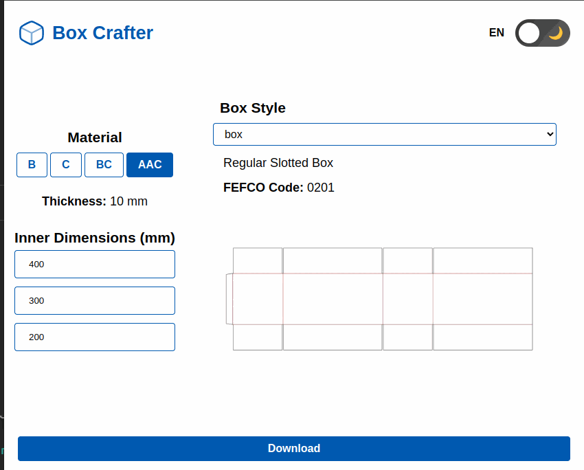

# 📦 Box Crafter


A fast, browser-based tool for generating unfolded box layouts — enter your inner dimensions, pick a material and box style, and download a DXF file ready for a cutter or CAD software.

Useful for **packaging designers, corrugated box manufacturers, laser cutters,** and anyone producing FEFCO-style boxes from sheet material.

🌐 **Live Demo:** [box-crafter.netlify.app](https://box-crafter.netlify.app)

---

## What it does

You enter three inner dimensions and choose a material:

| Input | Example |
|---|---|
| **Length** (inner) | 300 mm |
| **Width** (inner) | 200 mm |
| **Height** (inner) | 150 mm |
| **Material** | BC flute — 5 mm |

Box Crafter adds the correct thickness offsets and flap allowances automatically, then generates the full unfolded cut-and-crease layout as a DXF file.

---

## Box styles

| Style | FEFCO code | Description |
|---|---|---|
| Box | 0201 | Regular slotted box — closed top and bottom |
| Box open | 0200 | Open-top box |
| Half | 0201 | Half-height regular slotted box |
| Half open | 0200 | Half-height open box |

---

## Features

- **Four FEFCO box styles** — regular, open-top, and half-height variants
- **Four material thicknesses** — B (3 mm), C (4 mm), BC (5 mm), AAC (10 mm)
- **Automatic offset calculation** — thickness and flap heights computed per material
- **DXF export** — cut lines on the default layer, crease lines on a separate red `Crease` layer
- **Dark / light theme** — persisted in `localStorage`
- **English and Slovak UI** — language follows browser locale via `react-i18next`
- **Runs entirely in the browser** — no server, no account, no data upload

---

## Getting started

**Requirements:** Node.js 18+

```bash
git clone https://github.com/rekcoob/box_crafter.git
cd box_crafter
npm install
npm run dev        # opens at http://localhost:5173
```

Other commands:

```bash
npm run build      # type-check + production build
npm run preview    # preview the production build locally
npm run lint       # ESLint
npm run test       # run Cypress e2e tests (requires dev server running)
```

---

## How to use

1. Enter your **inner dimensions** — length, width, height
2. Select a **material** — sets the sheet thickness (B / C / BC / AAC)
3. Pick a **box style**
4. Click **Download DXF** — file downloads instantly

---

## Tech stack

| Layer | Technology |
|---|---|
| Framework | React 18 + TypeScript |
| Build tool | Vite |
| DXF generation | [`dxf-writer`](https://github.com/tarikjabiri/dxf) |
| i18n | `react-i18next` |
| Styling | CSS custom properties |
| Tests | Cypress (e2e) |

---

## Project structure

```
src/
├── context/        # React Context providers — dimensions, box style, material thickness, theme
├── dxf/            # DXF generators: box.ts, boxOpen.ts, half.ts, halfOpen.ts + dxfFactory.ts
├── services/       # downloadFile.ts (entry point), download.ts (blob trigger)
├── locales/        # en.json, sk.json
└── components/     # DimensionsInput, MaterialButtons, BoxStyleButtons, DownloadBtn, ThemeToggle
```

The geometry logic lives in the individual generator files under `src/dxf/` — each takes `(l, w, h, t)` and returns a DXF string.

---

## Contributing

Issues and pull requests are welcome. If you work in packaging or corrugated manufacturing, real-world feedback on FEFCO tolerances is especially valuable.

---

## License

MIT
